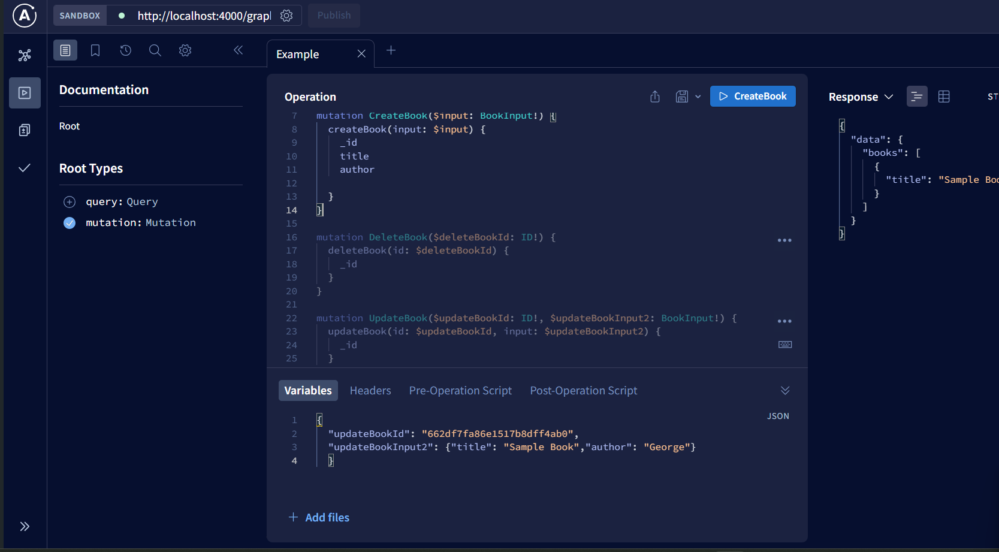

## MongoDb GraphQl

## STEPS

1. Define your Mongoose models.
2. Define the graphql schema.
3. Implement Resolver Functions
4. Connect GraphQL with MongoDB using Mongoose
5. Test

## TEST

**Query to read**

```
query Example{
books {
    _id
    title
    author
    }
}

```

**Create Mutation**

```
mutation CreateBook($input: BookInput!) {
createBook(input: $input) {
        _id
        title
        author
        }
}

```

**Delete Mutation**

```
mutation DeleteBook($deleteBookId: ID!) {
  deleteBook(id: $deleteBookId) {
    _id
  }
}
```

**Update Mutation**

```
mutation UpdateBook($updateBookId: ID!, $updateBookInput2: BookInput!) {
  updateBook(id: $updateBookId, input: $updateBookInput2) {
    _id
  }
}
```

### ScreenShot


